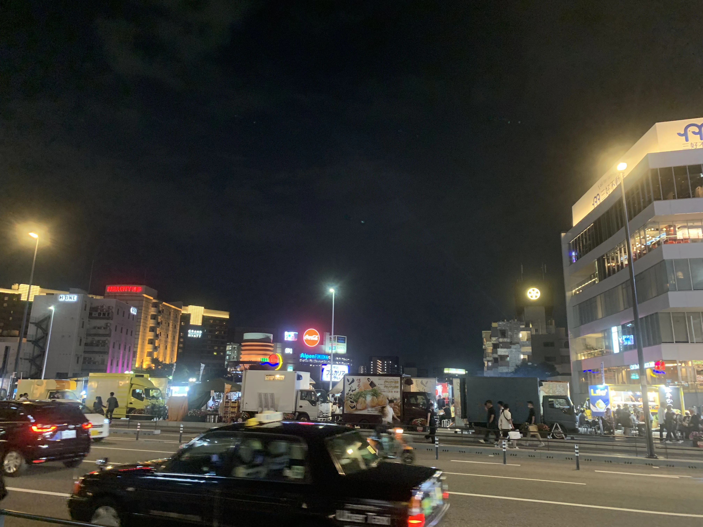

import ImageGallery from '@components/ImageGallery.astro'
export const folder = 'fukuoka-travel'

## Table of Contents

## 여행 목적과 준비

수험생 기간, 그리고 그보다 더 길었던 코로나 기간 동안 여행을 물론이고 가족들과 함께 멀리 나간 적이 없었습니다. 올해 들어서도 급하게 유학 준비를 하느라 서류에 비자에 시험에 바쁘게 지내다 보니 5월에 들어서야 숨을 돌리고 오랜만에 일본으로 여행을 계획하게 되었습니다.

오사카 인근에 친척이 살고 있어서 그 부근은 자주 갔었다보니 이번에는 가장 가까움에도 불구하고 한번도 가보지 못한 후쿠오카에 가보기로 했습니다. 찾아보니 후쿠오카는 **쇼핑**과 **온천**, 이 두가지가 키워드인 듯 싶었는데, 가족 여행이다보니 쇼핑은 거의 배제하고 후쿠오카 시내 구경과 료칸에 가는 것을 중심으로 계획을 세웠습니다.

여행 준비는 비행기 표 예매와 여행 일정으로, 비행기는 인터파크를 통해 제주항공 왕복 티켓을 예매했고 이때 최대 5일간 하루 500MB의 데이터를 사용할 수 있는 프로모션이 있길래 이것도 신청했습니다.

여행 일정은 처음으로 제가 직접 계획을 세웠는데(숙소 제외) 앞서 말한 것처럼 후쿠오카 시내 구경과 료칸을 중심으로 계획을 세웠습니다. 후쿠오카 시내는 오호리 공원과 후쿠오카 타워가 대표적인 것 같았고 인근 지역으로 다자이후, 유후인, 벳부 등이 있어 이를 3일간 잘 나누어보려고 했습니다.

## 첫째 날

## 공항에서 숙소까지

아침 7시 15분 비행기라 새벽 3시부터 일어나서 씻고 준비하고 김해공항으로 향해 6시쯤 도착했습니다. 스마트패스(인천공항과는 별도로 등록)를 등록하니 편리하더라고요. (짐은 다 기내용) 수속과 검색을 마치고 나니 아직 45분쯤 남길래 일본을 곧 가니 뭐 먹기도 애매해서 의자에서 기다리다가 비행기에 탑승했습니다.

<ImageGallery folder={folder} images={
    [
        {src: 'airplane.webp', alt: '김해공항에서 비행기 탑승'},
        {src: 'welcome-fukuoka.webp', alt: '후쿠오카 공항 도착'},
    ]
} />

후쿠오카 공항에 도착하니 입국 절차는 출국할 때보다는 훨씬 기다리는 시간이 컸습니다. VisitJapan을 미리 등록해감에도 불구하고 다른 사람들과 같은 줄에 서서 가기 때문에 대기 시간은 동일하지만 그냥 전화기만 들고 있으면 되는 게 편리하더라고요. (하지만 제일 편한 점은 짐을 맡긴 게 없다는 거)

그렇게 정식으로 일본에 입국하고 나니 8시 20분쯤 되었는데(비행기는 40분 걸리더라고요? 서울-울산이 1시간 걸렸는데...), 저희는 그날 후쿠오카 시내를 돌아다니기 위해 **후쿠오카 지하철 패스 1일권**을 미리 구매해두었고, 출국장을 나오자마자 오른편에 있는 HIS 매대에서 8시 반이 되어 패스를 받아 공항을 나섰습니다.

그렇다면 숙소까지 지하철을 타고 갔느냐? 아닙니다. 숙소는 하카타 역에 있었는데, 택시비가 약 1500엔정도 나온다고 뜨더군요. 그런데 우버 택시가 매달 신규 가입자에게 4번 정도 2000엔을 할인하는 프로모션이 있어서 어찌됐든 세명에 짐도 있으니 우버 택시를 이용하기로 했습니다. 참고로 후쿠오카 공항에서 우버 택시 타는 곳은 공항에 있는 표지들을 따라가보면 주차장에 오게 되는데 여기서 부르시면 됩니다.

## 다자이후

그렇게 하카타 역에 도착하니 9시가 겨우 넘은 시간이라 체크인은 하지 못하고 짐만 맡긴 후 하카타 버스 터미널(역과 연결되어 있음)에서 **다자이후**로 가는 버스를 타기로 했습니다. 정거장으로 향하니 약 20~30분마다 다자이후행 버스가 있었고 표는 다자이후행 문의 반대편에서 구입할 수 있었습니다. (편도 700엔) 사람이 많은 경우 표가 있어도 못 탈 수도 있지만 다음 버스가 금방금방 옵니다.

일단 다자이후에 도착하자마자 아침을 먹기 위해 버스 터미널 바로 옆의 라멘집으로 들어갔습니다. 밖에 있는 자판기에서 라멘 티켓?을 구입하면 기다리는 동안 점원이 주문서를 갔다 주는데 여기서 재료랑 맛을 선택할 수 있으며 한국어로도 적혀있습니다. 저는 맵기를 기본으로 선택했는데 별로 맵지 않고 희미하게 느껴지는 정도여서 매운 맛을 좋아하시는 분들은 적어도 3~4배는 해야 느껴질 것 같습니다. 그래도 빈속에 먹는거라 엄청 매운게 안 땡기기도 하고 기본도 맛있어서 잘 먹고 나왔습니다.

<ImageGallery folder={folder} images={
    [
        {src: 'dazaifu-terminal.webp', alt: '다자이후 버스 터미널'},
        {src: 'ramen-store.webp', alt: '다자이후 라멘집'},
        {src: 'ramen-order-sheet.webp', alt: '다자이후 라멘 주문서'},
        {src: 'ramen.webp', alt: '다자이후 라멘'},
    ]
} />

다자이후에는 텐만궁이라는 학문의 신을 모시는 신사가 있고 버스터미널에서 신사까지 먹거리와 가게로 가득한 길이 있어서 걸어가면서 구경하는 재미가 있습니다. 특히 이곳 스타벅스가 유명한 건축가가 디자인하여 신기한 구조를 가지고 있다고 합니다.

텐만궁에서는 입구에 있는 황소상의 머리를 만지면 머리가 좋아진다는 속설이 있어서 땡볕에 줄을 서서 만지고 왔습니다. ~~쇠냄새때문에 머리가 더 아픈 것 같은..~~ 텐만궁이 엄청나게 큰 곳은 아니라서 둘러보는 데 얼마 걸리지는 않지만 처마 위 정원이 있는 등 나름 볼거리가 있어서 재미있게 구경했습니다.

<ImageGallery folder={folder} images={
    [
        {src: 'dazaifu-starbucks.webp', alt: '다자이후 스타벅스'},
        {src: 'dazaifu-starbucks-inside.webp', alt: '다자이후 스타벅스 내부'},
        {src: 'dazaifu-tenmangu-bull.webp', alt: '다자이후 텐만궁 황소상'},
        {src: 'dazaifu-tenmangu-torii.webp', alt: '다자이후 텐만궁 토리(입구)'},
        {src: 'dazaifu-tenmangu-walk1.webp', alt: '다자이후 텐만궁 다리'},
        {src: 'dazaifu-tenmangu-walk2.webp', alt: '다자이후 텐만궁 연못'},
        {src: 'dazaifu-tenmangu-main-building.webp', alt: '다자이후 텐만궁 처마정원'},
        {src: 'dazaifu-umaegaemochi.webp', alt: '다자이후 우메가에모치'},
    ]
} />

사진을 찍지는 않았지만 신사 내부에서 원숭이 공연도 보고 다시 버스를 타러 가는 길에 우메가에모치(떡)도 먹었는데, 원숭이가 좀 무서워하는 것 같아서 약간 안쓰러웠고 떡은 그냥 가래떡에 텁텁한 팥죽 굳은 것 같은게 앙금으로 들어있어서 딱히 맛있다고 느끼지는 못했습니다.

전반적으로 짧게 갔다오는 게 맞는 선택이었던 것 같고 그래도 신사가 잘 되어있어 기회가 된다면 가보는 것도 좋을 것 같습니다.

## 오호리 공원

다자이후에서 하카타로 버스를 타고 돌아온 후, 지하철을 타고 오호리 공원으로 향했습니다. 오호리 공원은 산책하기에는 좋아보였지만 날이 너무 후덥지근해서 도저히 엄두가 안나더라고요.

그래서 안에 있는 시립 미술관에서 나눠져서 어머니께서는 작품들 관람하시고 아버지와 저는 근처의 후쿠오카 성터로 향했습니다.

<ImageGallery folder={folder} images={[
    {src: 'ohori-park.webp', alt: '오호리 공원'},
    {src: 'ohori-park-art-museum-inside.webp', alt: '오호리 공원 시립 미술관 내부'},
    {src: 'fukuoka-castle-remains1.webp', alt: '후쿠오카 성터1'},
    {src: 'fukuoka-castle-remains2.webp', alt: '후쿠오카 성터2'},
    {src: 'ohori-park-city.webp', alt: '후쿠오카 성터에서 본 후쿠오카 시내'}
]} />

성터는 미술관에서 걸어서 약 5분 정도 걸리고 조금 올라가야 하는데 올라가면 위의 3~5번째 사진처럼 말그대로 성터와 후쿠오카 시내가 보이는데 마지막 사진의 저 멀리 보이는 뾰족한 게 다음으로 갈 후쿠오카 타워입니다.

참고로 전 미술관을 구경하진 않았지만 나름 유명한 작가들의 작품이 하나씩 있어서 나쁘지 않았다고 하시더라고요.

## 후쿠오카 타워/모모치 해변

오호리 공원에서 후쿠오카 타워까지 가는 길은 원래는 지하철을 탈 생각이었으나 기온 이슈로 택시를 타고 갔습니다. (우버 택시 프로모션이 좋긴 하더라고요)

타워에 도착해서는 안에서 티켓을 바꾼 뒤에(미리 클룩에서 구매) 일몰까지는 시간이 남아서 모모치해변의 [Mammamia](https://g.co/kgs/w1pfsFR)라는 곳에서 피자와 파스타를 저녁으로 먹었습니다.

후쿠오카 타워는 전망대가 3층으로 나뉘어져 있는데 1층은 주위 건물들과 높이가 비슷해 야경 전망은 별로고 2층은 카페이며 3층이 주위가 제일 잘 보입니다. 날씨 앱에서 일몰 시간을 확인해 맞춰서 올라가니 타워의 한 쪽 모퉁이가 가장 일몰을 찍기 적합했고 지는 약 2분 동안 영상과 사진을 찍을 수 있었습니다. ~_하지만 구름에 가렸다..._~ 이후 야경을 찍기 위해 반대쪽에서 기다리고 있는데 분명 일상 중에는 순식간에 어두워지는 것 같았는데 거의 40분을 기다려서야 야경이라고 불릴만한 어둠이 찾아왔습니다. (그마저도 필터 씌우니까 더 제 취향의 밝기더군요) 마지막 사진이 제일 마음에 드는 것 같습니다. 참고로 3층에 가시면 바닥에 야광 별이 부착된, 후쿠오카 타워를 검색하면 보이는 포토 스팟이 있는데, 사람이 너무 많기도 하고 절 찍는 것을 안 좋아하기도 해서 거기는 스킵하고 왔습니다.

<ImageGallery folder={folder} images={[
    {src: 'momochi-beach-sunset.webp', alt: '모모치 해변에서의 일몰'},
    {src: 'fukuoka-tower.webp', alt: '후쿠오카 타워'},
    {src: 'fukuoka-tower-elevator.webp', alt: '후쿠오카 타워 엘리베이터 안'},
    {src: 'sunset-from-tower.webp', alt: '후쿠오카 타워에서의 일몰'},
    {src: 'night-view1.webp', alt: '후쿠오카 야경1'},
    {src: 'night-view2.webp', alt: '후쿠오카 야경2'},
]} />

## 나카스 야시장

첫날의 마지막은 나카스의 야시장이었습니다. 가보면 일본 사람은 없고 다 관광객으로 강을 따라서는 포차가, 중간에 다리에서는 푸드 트럭이 손님을 맞이하고 있습니다. 저녁도 든든하게 먹었기 때문에 간단하게 맥주와 꼬치를 사서 먹었습니다. 사진을 찍으려다가 귀찮아져서 아래 사진 하나 밖에 없습니다 ㅋㅋㅋ

## 마무리

이렇게 하루를 즐기고 나서 하카타역에 돌아와 숙소에서 지락실을 보며 쉬었습니다.

2일차는 버스투어로 히타, 벳부, 그리고 유후인(과 료칸)을 가는 여정이 되겠습니다.